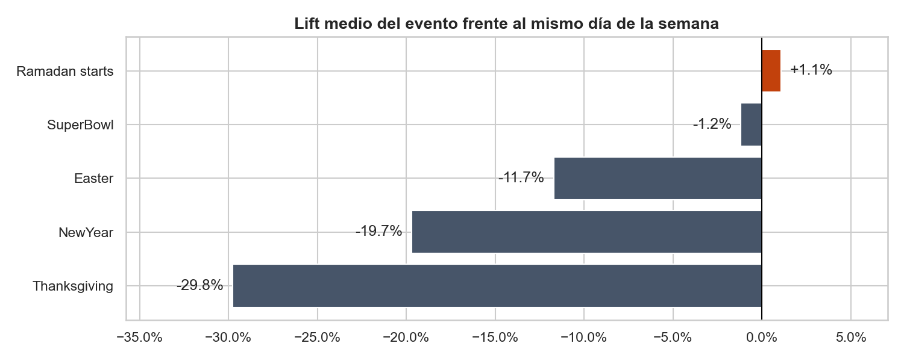
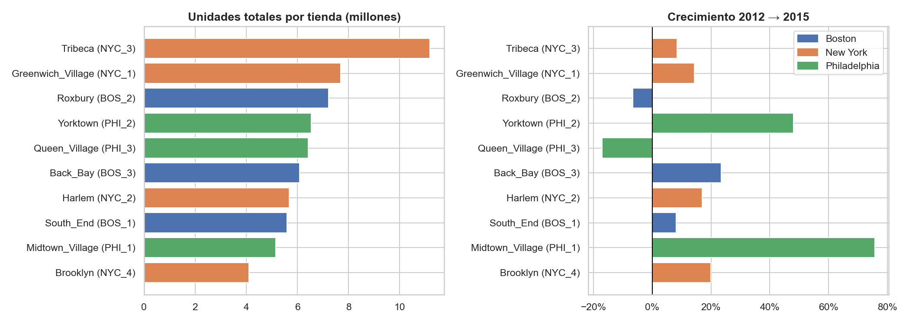
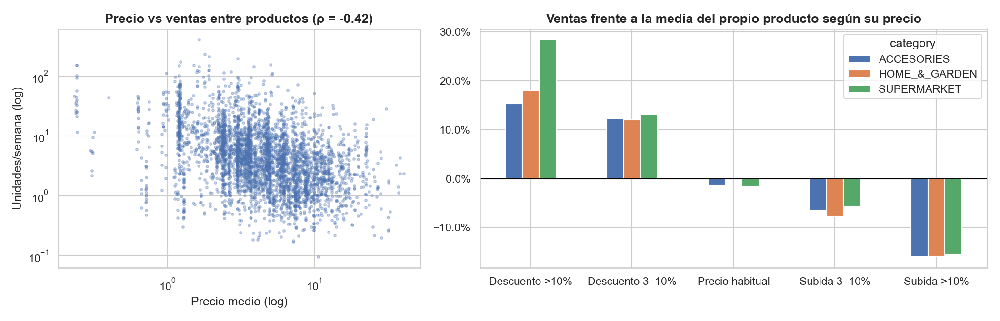
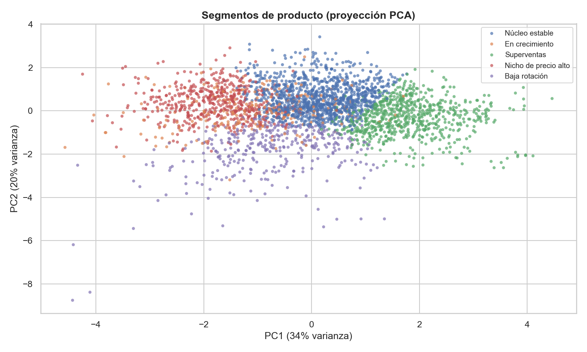

# DSMarket · Análisis de ventas y segmentación de productos

Proyecto final del **Máster en Data Science & AI** (Nuclio Digital School).

Análisis de más de 5 años de ventas diarias (2011–2016) de **3.049 productos en 10 tiendas** de Nueva York, Boston y Filadelfia: 58 millones de registros, sus precios semanales y un calendario de eventos.

📓 Notebook principal: [`DSMarket_mejorado.ipynb`](DSMarket_mejorado.ipynb)

## Hallazgos principales

- **Crecimiento del 4,6% anual** entre 2012 y 2015.
- **El fin de semana vende un ~37% más** que un miércoles. Agosto es el mejor mes y enero el peor.
- **Los festivos reducen las ventas**: Acción de Gracias −30% y Año Nuevo −20% frente al mismo día de la semana. Las tiendas cierran el 25 de diciembre.
- **Filadelfia crece un 25%**, con Midtown Village a +76%. Queen Village cae un 17%.
- **Un descuento de más del 10%** sube las ventas del producto un **+28% en alimentación** y un +15–18% en el resto.
- El **34% de los productos** genera el 80% de las unidades.
- El **73% de las series tiene demanda intermitente**, lo que obliga a usar métodos de previsión específicos.
- **5 segmentos de producto** (K-Means): Superventas, Núcleo estable, En crecimiento, Nicho de precio alto y Baja rotación.

## Técnicas utilizadas

- Carga eficiente en formato ancho con tipos compactos (`int16`, `category`): el análisis entero cabe en memoria **sin muestrear y sin `melt`** diario.
- Limpieza y validación de datos: duplicados, nulos, días cerrados y cruce de semanas entre ventas y precios.
- Índices de estacionalidad y **lift de eventos frente a una línea base del mismo día de la semana**.
- Cálculo de ingresos cruzando ventas semanales con precios semanales (8,5 millones de filas).
- Análisis de descuentos **dentro de cada producto** y correlación de Spearman entre productos.
- Curva de Pareto y clasificación de demanda **Syntetos-Boylan** (ADI / CV²).
- **K-Means** con variables de comportamiento, elección de k por codo y silueta, y visualización con PCA.

## Cómo ejecutarlo

1. Descomprime `data_dsmarket.zip` en esta carpeta para que queden los CSV en `data_dsmarket/data_dsmarket/`.
2. Instala las dependencias: `pip install pandas numpy matplotlib seaborn scikit-learn scipy`.
3. Abre y ejecuta `DSMarket_mejorado.ipynb`. Tarda menos de un minuto.

> Los CSV (~500 MB) no están en el repositorio porque superan el límite de tamaño de GitHub.
